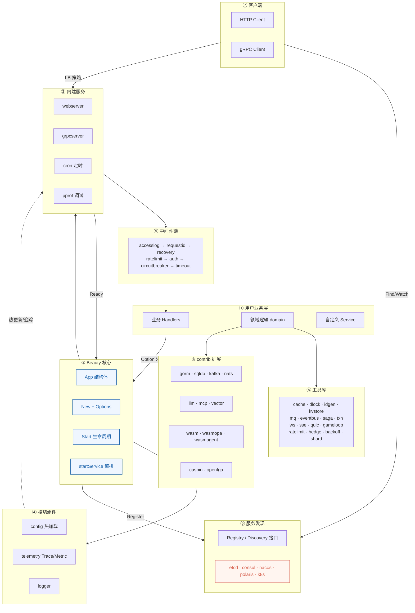
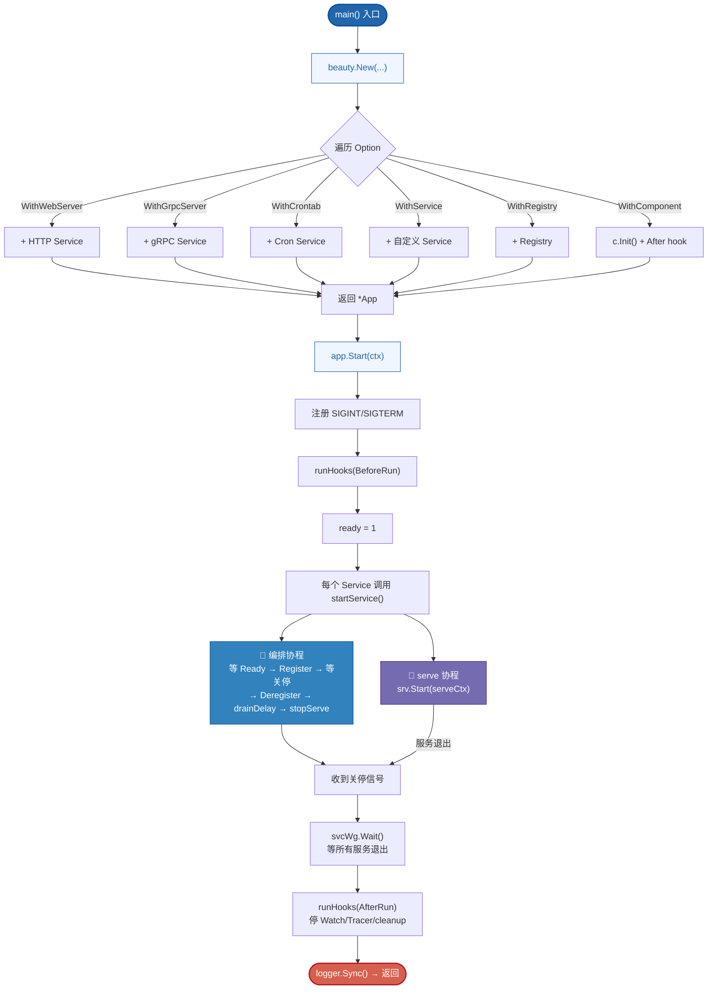
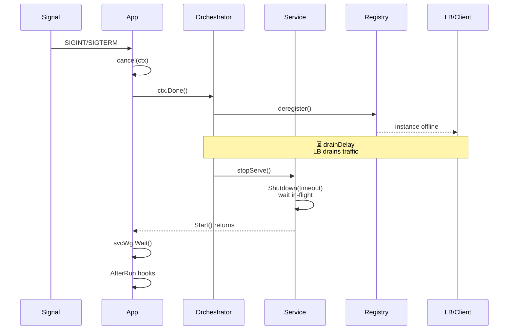
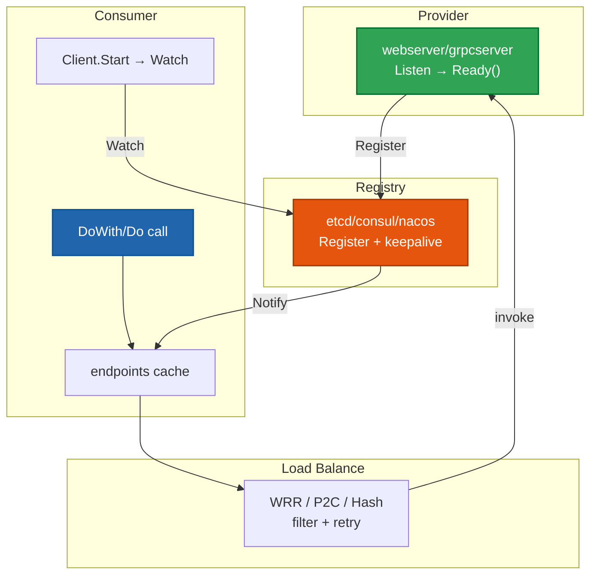
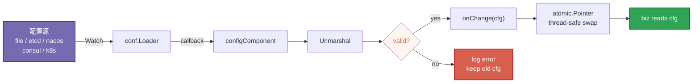
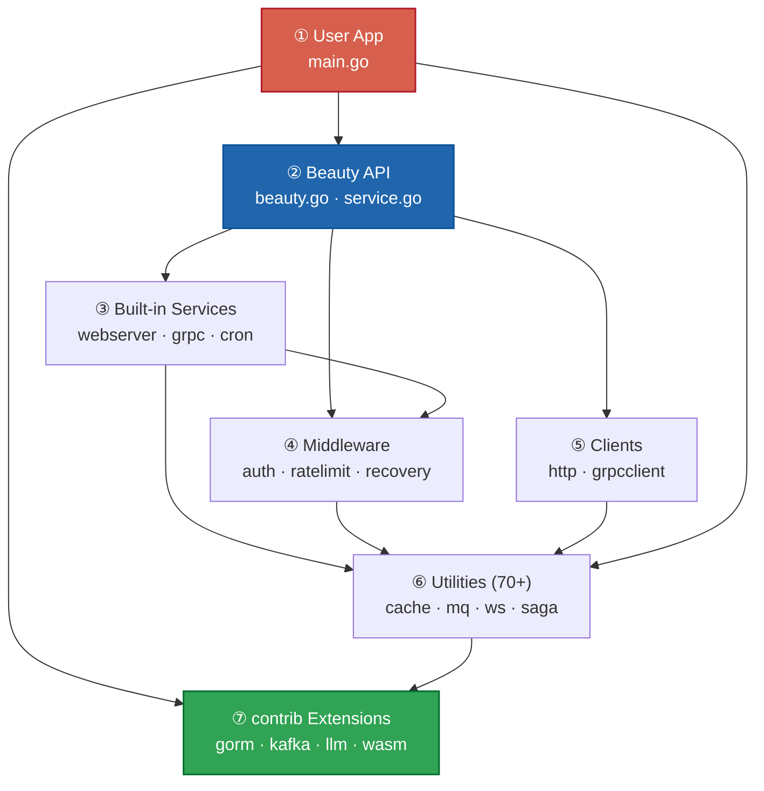

# 🏗️ Beauty Framework — Architecture

> **一套生命周期跑微服务 —— HTTP · gRPC · 定时 · 实时媒体 · WASM Agent 沙箱**

---

## Publication-Quality Color Palette (Nature/Science)

| 用途 | 色值 | 说明 |
|------|------|------|
| 主色 / 蓝 | `#2166AC` | Nature 经典蓝，主结构、入口节点 |
| 强调 / 红 | `#D6604D` | Nature 经典红，终止、警告节点 |
| 成功 / 绿 | `#31A354` | Provider、成功路径 |
| 警告 / 橙 | `#E6550D` | DB、Registry、数据存储 |
| 紫色 | `#756BB1` | 配置、辅助协程 |
| 背景浅蓝 | `#EFF6FF` | 流程节点填充 |
| 背景浅红 | `#FFF5F0` | 终止/警告节点填充 |
| 中性灰 | `#757575` | 连线、次要文字 |

---

## 📊 Core Metrics

| | |
|---|---|
| **工具包 (pkg/\*)** | 70+ |
| **contrib 扩展模块** | 17 |
| **内置中间件** | 12 |
| **服务发现后端** | 5 (etcd / consul / nacos / polaris / k8s) |

---

## FIG. 1 — 整体架构总览

Beauty 核心极小（`beauty.New` → `App.Start`），通过 Option 函数式选项组合任意 Service，统一生命周期管理。

---

## FIG. 2 — 启动与生命周期流程

每个 Service 启动时创建两个 goroutine：**编排协程**（就绪 → 注册 → 等待关停 → 注销 → drainDelay → stopServe）和 **serve 协程**（运行服务）。

---

## FIG. 3 — HTTP 请求处理流程

洋葱模型中间件：请求从外到内穿过中间件链，响应从内到外逆序返回。OTel 追踪在最外层，业务逻辑在中心。

```mermaid
flowchart LR
    C["Client"] -->|"HTTP Request"| OT["otelhttp<br/>Trace Span"]
    OT --> M1["accesslog"]
    M1 --> M2["requestid"]
    M2 --> M3["recovery"]
    M3 --> M4["timeout"]
    M4 --> M5["ratelimit"]
    M5 --> M6["auth/authz"]
    M6 --> M7["circuitbreaker"]
    M7 --> MUX["ServeMux<br/>路由"]
    MUX --> H["业务 Handler"]
    H --> D["domain<br/>业务逻辑"]
    D -->|"远程调用"| CLI["HTTP/gRPC Client"]
    CLI --> DISC["服务发现 + LB"]
    DISC --> REM["远程实例"]
    D --> DB[("DB / Cache")]
    H -->|"Response 逆序"| C

    style C fill:#2166AC,color:#fff,stroke:#08519C,stroke-width:1.5px
    style DB fill:#E6550D,color:#fff,stroke:#A63603,stroke-width:1.5px
    style REM fill:#31A354,color:#fff,stroke:#006D2C,stroke-width:1.5px
    style D fill:#EFF6FF,color:#2166AC,stroke:#2166AC
    style OT fill:#FFF5F0,color:#D6604D,stroke:#D6604D
```

---

## FIG. 4 — 优雅停机时序

**先注销 → 排空等待 → 停服务**，确保 LB 感知下线后不再路由新请求，同时处理完 in-flight 请求，实现滚动发布零停机。

---

## FIG. 5 — 服务发现与客户端调用

Server Listen 成功后 Register 到注册中心（keepalive 租约），Client Watch 端点列表本地缓存，调用时走负载均衡策略。

---

## FIG. 6 — 配置热更新流程

**先校验后提交**：conf.Loader Watch 配置源变更，先 Unmarshal 校验再提交；坏配置不会覆盖上一份可用值。

---

## FIG. 7 — 分层依赖关系

七层架构，依赖方向**自上而下**，核心极小 —— **机制而非策略**，用什么才引什么，按需组装。

---

## 📁 Files

| 文件 | 说明 |
|------|------|
| [`architecture.html`](architecture.html) | 发表级配色 HTML 可视化（推荐浏览器打开） |
| [`architecture-diagram.md`](architecture-diagram.md) | Markdown 版本，可在 GitHub/IDE 中直接渲染 |
