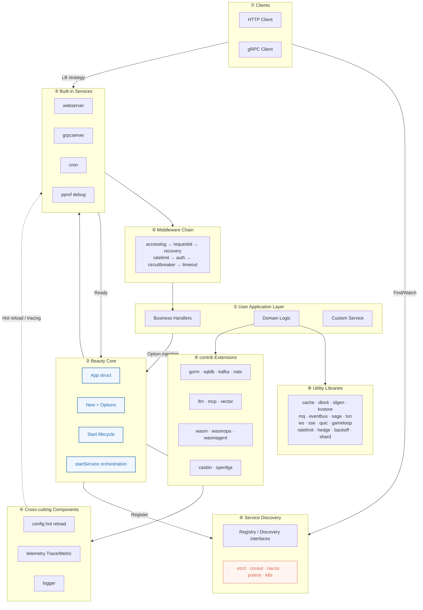
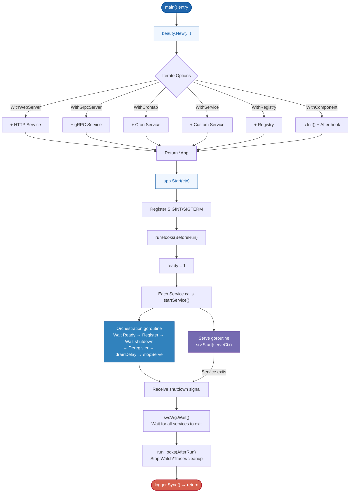
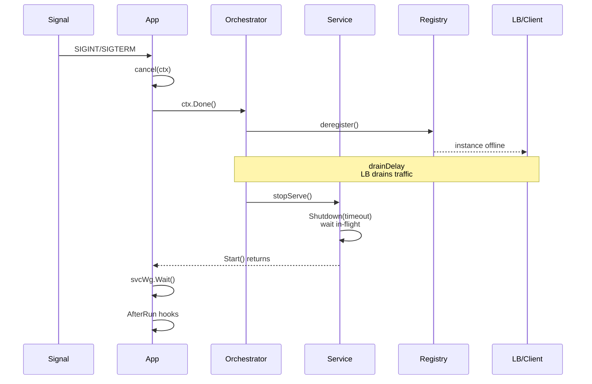
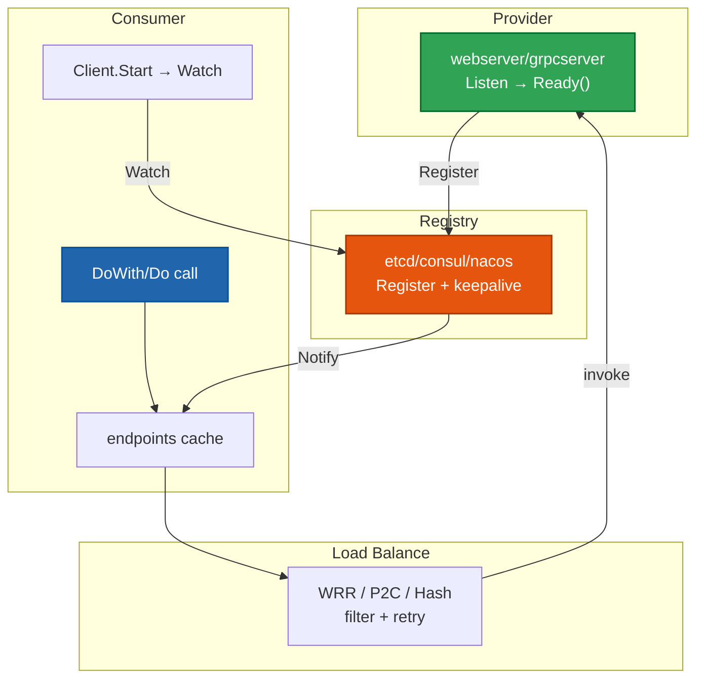
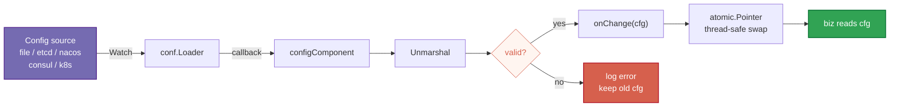
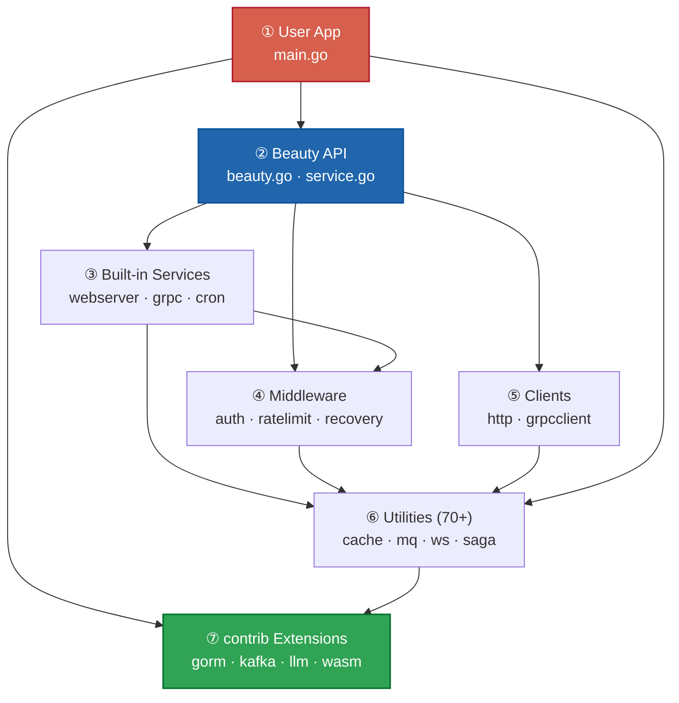

# Beauty Framework — Architecture

> **One lifecycle runs microservices — HTTP · gRPC · Cron · Real-time Media · WASM Agent Sandbox**

---

## Publication-Quality Color Palette (Nature/Science)

| Purpose | Color | Description |
|------|------|------|
| Primary / Blue | `#2166AC` | Nature classic blue — main structure, entry nodes |
| Accent / Red | `#D6604D` | Nature classic red — termination, warning nodes |
| Success / Green | `#31A354` | Provider, success paths |
| Warning / Orange | `#E6550D` | DB, Registry, data storage |
| Purple | `#756BB1` | Configuration, auxiliary goroutines |
| Light Blue Background | `#EFF6FF` | Flow node fill |
| Light Red Background | `#FFF5F0` | Termination/warning node fill |
| Neutral Gray | `#757575` | Connectors, secondary text |

---

## Core Metrics

| | |
|---|---|
| **Utility Packages (pkg/\*)** | 70+ |
| **contrib Extension Modules** | 17 |
| **Built-in Middleware** | 12 |
| **Service Discovery Backends** | 5 (etcd / consul / nacos / polaris / k8s) |

---

## FIG. 1 — Overall Architecture Overview

Beauty's core is minimal (`beauty.New` → `App.Start`). Option functional options compose any number of Services under unified lifecycle management.

---

## FIG. 2 — Startup and Lifecycle Flow

Each Service spawns two goroutines on startup: an **orchestration goroutine** (ready → register → wait for shutdown → deregister → drainDelay → stopServe) and a **serve goroutine** (runs the service).

---

## FIG. 3 — HTTP Request Processing Flow

Onion-model middleware: requests pass through the middleware chain from outside in; responses return in reverse order. OTel tracing is outermost; business logic sits at the center.

```mermaid
flowchart LR
    C["Client"] -->|"HTTP Request"| OT["otelhttp<br/>Trace Span"]
    OT --> M1["accesslog"]
    M1 --> M2["requestid"]
    M2 --> M3["recovery"]
    M3 --> M4["timeout"]
    M4 --> M5["ratelimit"]
    M5 --> M6["auth/authz"]
    M6 --> M7["circuitbreaker"]
    M7 --> MUX["ServeMux<br/>routing"]
    MUX --> H["Business Handler"]
    H --> D["domain<br/>business logic"]
    D -->|"Remote call"| CLI["HTTP/gRPC Client"]
    CLI --> DISC["Service discovery + LB"]
    DISC --> REM["Remote instance"]
    D --> DB[("DB / Cache")]
    H -->|"Response (reverse order)"| C

    style C fill:#2166AC,color:#fff,stroke:#08519C,stroke-width:1.5px
    style DB fill:#E6550D,color:#fff,stroke:#A63603,stroke-width:1.5px
    style REM fill:#31A354,color:#fff,stroke:#006D2C,stroke-width:1.5px
    style D fill:#EFF6FF,color:#2166AC,stroke:#2166AC
    style OT fill:#FFF5F0,color:#D6604D,stroke:#D6604D
```

---

## FIG. 4 — Graceful Shutdown Sequence

**Deregister first → drain wait → stop service** ensures the load balancer stops routing new requests after the instance goes offline, while in-flight requests complete—enabling zero-downtime rolling deployments.

---

## FIG. 5 — Service Discovery and Client Calls

After the server listens successfully, it registers with the registry (keepalive lease). The client watches the endpoint list and caches it locally; calls use load balancing strategies.

---

## FIG. 6 — Configuration Hot Reload Flow

**Validate before commit**: `conf.Loader` watches the configuration source for changes, unmarshals and validates first, then commits; invalid configuration does not overwrite the last known good value.

---

## FIG. 7 — Layered Dependency Relationships

Seven-layer architecture with dependencies flowing **top-down**. The core is minimal — **mechanisms, not policy**; import only what you use and assemble as needed.

---

## Files

| File | Description |
|------|------|
| [`architecture.html`](architecture.html) | Publication-quality HTML visualization (recommended in browser) |
| [`architecture-diagram.md`](architecture-diagram.md) | Markdown version, renders directly in GitHub/IDE |
