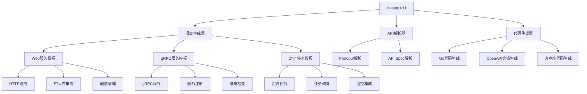

# Beauty Framework 工具链

Beauty Framework 是一个现代化的Go微服务开发框架，提供完整的开发工具链，包括项目生成、API解析、代码生成等功能。

## ✨ 主要特性

- 🚀 **快速项目生成** - 一键创建多种类型的微服务项目
- 📡 **API解析** - 支持Protobuf和传统API定义格式
- 🔧 **代码生成** - 自动生成gRPC、HTTP、客户端代码
- 🏗️ **完整模板** - 预置Web、gRPC、定时任务等模板
- 🔌 **框架集成** - 深度集成Beauty框架所有功能
- ⚙️ **配置管理** - 完整的配置系统和环境管理
- 🛡️ **中间件支持** - 认证、限流、超时、熔断器等
- 📊 **监控集成** - 链路追踪、指标监控、日志管理
- 🔍 **服务发现** - 支持etcd、nacos等服务注册中心

## 🏗️ 工具架构



## 🚀 快速开始

### 安装

```bash
# 克隆项目
git clone https://github.com/rushteam/beauty.git
cd beauty/tools

# 构建工具
go build -o beauty ./cmd/beauty

# 或者直接运行
go run ./cmd/beauty --help
```

### 5分钟快速体验

```bash
# 1. 创建HTTP微服务
./beauty new user-service --template web-service

# 2. 创建gRPC微服务  
./beauty new product-service --template grpc-service

# 3. 创建定时任务服务
./beauty new cleanup-job --template cron-service

# 4. 进入项目目录
cd user-service

# 5. 安装依赖并运行
go mod tidy
go run main.go
```

### 基本使用

```bash
# 查看帮助
./beauty --help

# 查看版本
./beauty --version
```

## 📋 命令列表

### 1. 创建新项目或添加服务 (`new`)

创建新的Beauty项目或向现有项目添加服务，支持智能检测和补充。

```bash
# 创建新项目
./beauty new my-project

# 向现有项目添加服务
./beauty new . --grpc
./beauty new /path/to/project --web --cron

# 指定模板类型
./beauty new my-service --template grpc-service

# 指定项目路径
./beauty new my-service --path /path/to/project

# 包含Docker和K8s配置
./beauty new my-service --with-docker --with-k8s

# 详细输出
./beauty new my-service --verbose
```

#### 支持的模板类型

- **web-service** (默认) - HTTP微服务
- **grpc-service** - gRPC微服务
- **cron-service** - 定时任务服务
- **full-stack** - 完整微服务栈

#### 功能特性

- **智能检测** - 自动检测现有项目结构，识别已包含的服务类型
- **安全补充** - 智能跳过已存在的文件，避免覆盖现有代码
- **交互式选择** - 支持交互式选择要添加的服务类型
- **保持配置** - 保持现有项目配置不变，只添加缺失的服务文件

#### 示例

```bash
# 创建HTTP微服务
./beauty new user-service --template web-service

# 创建gRPC微服务
./beauty new product-service --template grpc-service

# 创建定时任务服务
./beauty new cleanup-job --template cron-service

# 向现有web项目添加gRPC服务
./beauty new user-service --grpc

# 向现有项目添加多种服务
./beauty new my-project --web --grpc --cron

# 在当前目录添加服务
./beauty new . --grpc
```

### 2. API解析 (`api`)

解析API定义文件并生成代码，支持protobuf和传统格式。

```bash
# 基本用法
./beauty api <项目路径>

# 非交互模式生成代码
./beauty api my-project --generate

# 指定输出目录
./beauty api my-project --out gen/go

# 生成OpenAPI文档
./beauty api my-project --openapi

# 输出JSON格式
./beauty api my-project --json

# 离线模式
./beauty api my-project --offline
```

#### 支持的API格式

- **Protobuf** (.proto) - 推荐格式
- **API Spec** (.spec) - 传统格式

#### 示例

```bash
# 解析protobuf文件
./beauty api ./api --generate --openapi

# 解析并生成到指定目录
./beauty api ./api --out ./generated --generate
```

### 3. 开发模式 (`dev`)

在开发模式下运行服务，支持热重载和调试。

```bash
# 基本用法
./beauty dev

# 指定配置文件
./beauty dev --config config/dev/app.yaml

# 监听文件变化
./beauty dev --watch

# 调试模式
./beauty dev --debug
```

### 4. 构建项目 (`build`)

构建项目为可执行文件。

```bash
# 基本构建
./beauty build

# 指定输出文件名
./beauty build --output my-service

# 指定目标平台
./beauty build --platform linux/amd64
```

## 🏗️ 项目结构

### Web服务模板

```
my-service/
├── main.go                    # 主程序入口
├── go.mod                     # Go模块文件
├── config/                    # 配置文件
│   └── dev/
│       └── app.yaml          # 开发环境配置
└── internal/                  # 内部包
    ├── config/               # 配置管理
    │   └── config.go
    ├── endpoint/             # 端点处理
    │   ├── handlers/         # 处理器
    │   └── router/           # 路由
    └── infra/                # 基础设施
        ├── conf/             # 配置结构
        ├── logger/           # 日志
        ├── middleware/       # 中间件
        └── registry/         # 服务注册
```

### gRPC服务模板

```
my-grpc-service/
├── main.go                    # 主程序入口
├── go.mod                     # Go模块文件
├── config/                    # 配置文件
│   └── dev/
│       └── app.yaml          # 开发环境配置
└── internal/                  # 内部包
    ├── config/               # 配置管理
    ├── endpoint/             # 端点处理
    │   └── grpc/             # gRPC服务
    └── infra/                # 基础设施
        ├── conf/             # 配置结构
        ├── logger/           # 日志
        ├── middleware/       # 中间件
        └── registry/         # 服务注册
```

### 定时任务模板

```
my-cron-service/
├── main.go                    # 主程序入口
├── go.mod                     # Go模块文件
├── config/                    # 配置文件
│   └── dev/
│       └── app.yaml          # 开发环境配置
└── internal/                  # 内部包
    ├── config/               # 配置管理
    ├── job/                  # 定时任务
    │   └── cron.go
    └── infra/                # 基础设施
        ├── conf/             # 配置结构
        ├── logger/           # 日志
        ├── middleware/       # 中间件
        └── registry/         # 服务注册
```

## ⚙️ 配置说明

### 应用配置 (app.yaml)

```yaml
# 应用基本信息
app:
  name: "my-service"
  version: "1.0.0"
  description: "我的微服务"

# HTTP服务配置
http:
  addr: ":8080"
  timeout: 30s
  read_timeout: 10s
  write_timeout: 10s

# 日志配置
log:
  level: "info"
  format: "json"

# 数据库配置
database:
  driver: "mysql"
  dsn: "user:password@tcp(localhost:3306)/dbname?charset=utf8mb4&parseTime=True&loc=Local"

# Redis配置
redis:
  addr: "localhost:6379"
  password: ""
  db: 0

# 服务注册配置
registry:
  type: "etcd"
  endpoints: ["localhost:2379"]

# 中间件配置
middleware:
  auth:
    enabled: true
    secret: "your-secret-key"
  rate_limit:
    enabled: true
    requests: 100
    window: "1m"
  timeout:
    enabled: true
    duration: "5s"
  circuit_breaker:
    enabled: true
    failure_threshold: 5
    timeout: "30s"
```

## 🔧 开发指南

### 添加新的代码生成器

1. 实现 `CodeGenerator` 接口
2. 在 `generator/manager.go` 中注册
3. 添加相应的模板文件

### 添加新的服务模板

1. 在 `tpls/` 目录下创建新模板目录
2. 更新 `tpls/embed.go` 中的嵌入配置
3. 在 `GetTemplateRoot` 函数中添加新的模板类型

### 自定义模板

模板使用Go的 `text/template` 包，支持以下变量：

- `{{.Name}}` - 项目名称
- `{{.Module}}` - 模块名称
- `{{.Template}}` - 模板类型
- `{{.WithDocker}}` - 是否包含Docker配置
- `{{.WithK8s}}` - 是否包含K8s配置

## 📚 使用示例

### 示例1：创建用户服务

```bash
# 创建用户服务项目
./beauty new user-service --template web-service

# 进入项目目录
cd user-service

# 查看生成的项目结构
tree .

# 安装依赖
go mod tidy

# 运行服务
go run main.go
```

### 示例2：创建商品gRPC服务

```bash
# 创建商品gRPC服务
./beauty new product-service --template grpc-service --with-docker

# 进入项目目录
cd product-service

# 查看gRPC服务配置
cat config/dev/app.yaml

# 安装依赖并运行
go mod tidy
go run main.go
```

### 示例3：创建定时清理任务

```bash
# 创建定时任务服务
./beauty new cleanup-job --template cron-service

# 进入项目目录
cd cleanup-job

# 查看定时任务配置
cat internal/job/cron.go

# 运行定时任务
go run main.go
```

### 示例4：API解析和代码生成

```bash
# 创建API项目目录
mkdir my-api-project
cd my-api-project

# 创建protobuf文件
cat > api.proto << 'EOF'
syntax = "proto3";

package api;

option go_package = "github.com/example/my-api/api";

service UserService {
  rpc GetUser(GetUserRequest) returns (GetUserResponse);
}

message GetUserRequest {
  string user_id = 1;
}

message GetUserResponse {
  string id = 1;
  string name = 2;
  string email = 3;
}
EOF

# 解析API并生成代码
../beauty api . --generate --openapi --out ./generated

# 查看生成的代码
ls -la generated/
```

## 💡 最佳实践

### 项目组织

```bash
# 推荐的项目结构
my-microservice/
├── api/                    # API定义文件
│   ├── proto/             # Protobuf文件
│   └── openapi/           # OpenAPI文档
├── cmd/                   # 命令行工具
├── internal/              # 内部包
├── pkg/                   # 公共包
├── config/                # 配置文件
├── deployments/           # 部署配置
└── docs/                  # 文档
```

### 开发流程

1. **创建项目**
   ```bash
   ./beauty new my-service --template web-service
   ```

2. **添加服务类型** (可选)
   ```bash
   # 向现有项目添加gRPC服务
   ./beauty new my-service --grpc
   
   # 添加定时任务服务
   ./beauty new my-service --cron
   
   # 在当前目录添加服务
   ./beauty new . --grpc
   ```

3. **定义API**
   ```bash
   # 创建protobuf文件
   vim api/proto/service.proto
   ```

4. **生成代码**
   ```bash
   ./beauty api api/proto --generate --openapi
   ```

5. **开发业务逻辑**
   ```bash
   # 实现处理器
   vim internal/endpoint/handlers/handlers.go
   ```

6. **测试和部署**
   ```bash
   go test ./...
   go build -o my-service
   ```

### 配置管理

- 使用环境变量覆盖配置
- 为不同环境创建不同的配置文件
- 敏感信息使用环境变量或密钥管理服务

### 监控和日志

- 启用结构化日志记录
- 配置指标收集
- 设置健康检查端点
- 配置链路追踪

## ❓ 常见问题

### Q: 如何选择正确的模板类型？

A: 根据你的服务类型选择：
- `web-service`: HTTP REST API服务
- `grpc-service`: gRPC微服务
- `cron-service`: 定时任务服务
- `full-stack`: 包含所有功能的完整服务

### Q: 生成的代码无法编译怎么办？

A: 检查以下几点：
1. 确保安装了正确的Go版本（1.19+）
2. 运行 `go mod tidy` 安装依赖
3. 检查配置文件格式是否正确
4. 查看详细错误信息：`go build -v`

### Q: 如何自定义生成的代码？

A: 可以通过以下方式自定义：
1. 修改模板文件（在 `tpls/` 目录下）
2. 使用模板变量（如 `{{.Name}}`、`{{.Module}}` 等）
3. 创建自定义模板目录

### Q: 支持哪些服务注册中心？

A: 目前支持：
- etcd
- nacos
- polaris
- kubernetes

### Q: 如何添加新的中间件？

A: 在生成的 `internal/infra/middleware/middleware.go` 文件中添加新的中间件配置。

### Q: 如何向现有项目添加新的服务类型？

A: 使用 `new` 命令：
```bash
# 向现有web项目添加gRPC服务
./beauty new my-project --grpc

# 在当前目录添加服务
./beauty new . --grpc

# 交互式选择要添加的服务
./beauty new my-project
```

### Q: new 命令会覆盖现有文件吗？

A: 不会。当在现有项目中使用 `new` 命令时，会智能跳过已存在的文件，只添加缺失的服务文件，确保不会覆盖现有代码。

## 🐛 故障排除

### 常见问题

1. **模板选择错误**
   ```bash
   # 确保使用正确的模板名称
   ./beauty new my-service --template grpc-service
   ```

2. **依赖下载失败**
   ```bash
   # 使用离线模式
   ./beauty api my-project --offline
   ```

3. **权限问题**
   ```bash
   # 确保对目标目录有写权限
   chmod 755 /path/to/project
   ```

4. **配置文件错误**
   ```bash
   # 检查YAML格式
   yamllint config/dev/app.yaml
   ```

5. **端口冲突**
   ```bash
   # 检查端口是否被占用
   lsof -i :8080
   ```

### 调试模式

```bash
# 启用详细输出
./beauty new my-service --verbose

# 查看所有标志
./beauty new my-service --help

# 检查生成的配置
cat config/dev/app.yaml
```

## 📚 相关文档

- [Beauty Framework 主文档](../../README.md)
- [API 设计指南](../../docs/api-protobuf-integration.md)
- [中间件使用指南](../../docs/middleware.md)
- [服务发现配置](../../docs/directory-upgrade.md)

## 📝 更新日志

### v0.0.3 (2024-12-19)

#### ✨ 新功能
- **统一 new 命令** - 将 add-service 功能合并到 new 命令中
- **智能项目检测** - 自动检测现有项目结构，识别已包含的服务
- **安全文件补充** - 智能跳过已存在的文件，避免覆盖现有代码
- **交互式服务选择** - 支持交互式选择要添加的服务类型
- **现有项目支持** - 支持在当前目录或现有项目中添加服务

#### 🔧 改进
- 优化项目结构检测算法
- 增强模板文件处理逻辑
- 完善错误处理和用户提示
- 简化命令结构，提供更统一的用户体验

### v0.0.1 (2024-09-06)

#### ✨ 新功能
- 支持多种服务模板（Web、gRPC、定时任务）
- 完整的代码生成器抽象化
- 深度集成Beauty框架功能
- 支持Protobuf和API Spec解析
- 完整的配置管理系统

#### 🔧 改进
- 升级到urfave/cli v3
- 优化模板系统
- 增强错误处理和调试信息
- 完善文档和示例

#### 🐛 修复
- 修复CLI参数解析问题
- 修复模板选择逻辑
- 修复代码生成器类型错误

## 🤝 贡献

欢迎贡献代码！请查看 [贡献指南](../../CONTRIBUTING.md) 了解详细信息。

### 开发环境设置

```bash
# 克隆项目
git clone https://github.com/rushteam/beauty.git
cd beauty/tools

# 安装依赖
go mod tidy

# 运行测试
go test ./...

# 构建工具
go build -o beauty ./cmd/beauty
```

### 提交代码

1. Fork 项目
2. 创建功能分支
3. 提交更改
4. 创建 Pull Request

## 📄 许可证

本项目采用 MIT 许可证。详情请查看 [LICENSE](../../LICENSE) 文件。

## 🙏 致谢

感谢所有为Beauty Framework做出贡献的开发者！

---

**Beauty Framework** - 让微服务开发更简单、更高效！ 🚀
